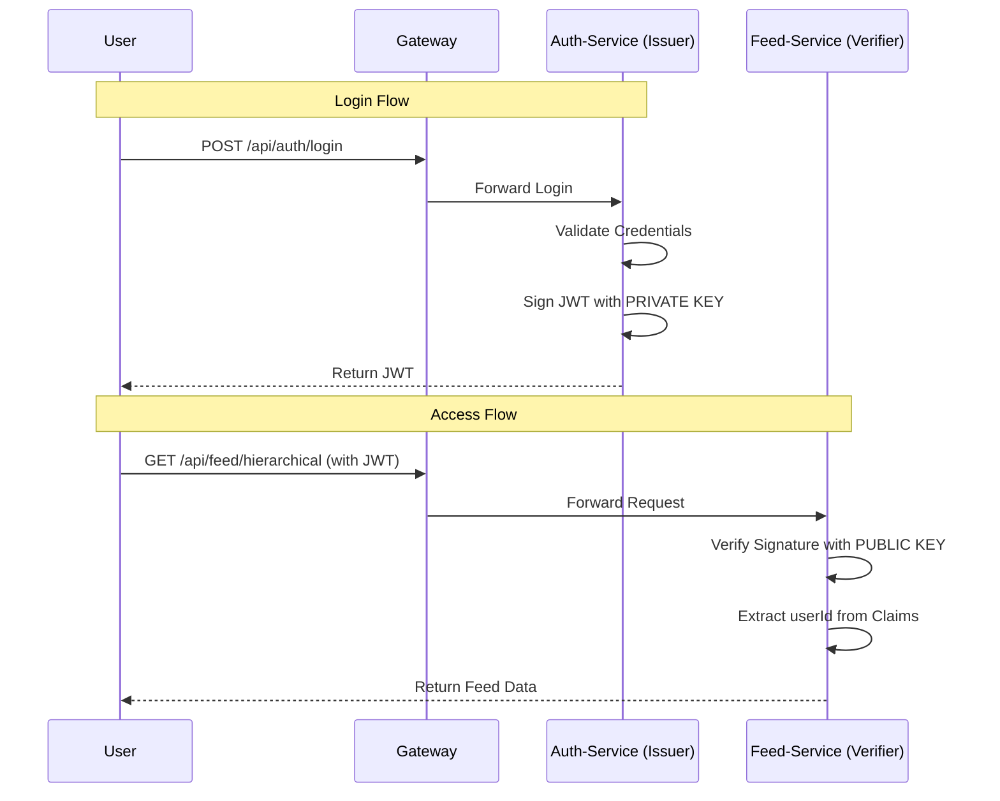

# JWT Authentication Flow: Antigravity Architecture

Antigravity uses a **Stateless, Asymmetric JWT Authentication** flow based on the **RS256** algorithm. This ensures that only the `auth-service` can issue tokens, while any other service can verify them without making a network call to the authentication server.

---

## 1. Key Components

| Component | Responsibility | Security Asset |
| :--- | :--- | :--- |
| **Auth Service** | **Issuer**: Authenticates users and generates tokens. | **Private Key** (Stored in `keystore.jks`) |
| **Resource Services** | **Verifiers**: Validate tokens in incoming requests. | **Public Key** (Stored in `public_key.pem`) |
| **API Gateway** | **Router**: Forwards requests to the correct service. | Roles/Routes configuration |

---

## 2. The Authentication Process (Step-by-Step)

### Phase A: Token Issuance (Login)
1.  **Request**: User sends a POST request with credentials to `gateway-service` (`/api/auth/login`).
2.  **Routing**: Gateway forwards the request to `auth-service`.
3.  **Authentication**: `auth-service` verifies credentials against the database.
4.  **Token Generation**:
    *   `JwtUtil` in `auth-service` loads the **Private Key** from the JKS keystore.
    *   It creates a JWT payload including the `username` (subject) and `userId`.
    *   It signs the JWT using the **RS256** algorithm.
5.  **Response**: The signed JWT is returned to the user.

### Phase B: Token Validation (Resource Access)
1.  **Request**: User sends a request to a protected resource (e.g., `GET /api/feed/hierarchical`) with the `Authorization: Bearer <token>` header.
2.  **Stateless Interception**: The `JwtAuthenticationFilter` in the target service (e.g., `feed-service`) intercepts the request.
3.  **Local Validation**:
    *   `JwtUtil` in the target service loads the **Public Key** certificate.
    *   It verifies the token signature using this Public Key.
    *   **Crucial**: The service does **not** call `auth-service`. If the signature matches the public key and the token isn't expired, it is trusted.
4.  **Security Context**:
    *   The `userId` is extracted from the token claims.
    *   The `UsernamePasswordAuthenticationToken` is set in Spring's `SecurityContextHolder`.
5.  **Service Logic**: The Controller processes the request using the authenticated `userId`.

---

## 3. Why RS256 (Asymmetric) instead of HS256 (Symmetric)?

*   **HS256 (Shared Secret)**: Every microservice would need the *same* secret key. if one service is compromised, the attacker can issue fake tokens for the entire system.
*   **RS256 (Private/Public Pair)**: 
    *   Only the `auth-service` has the **Private Key** (can *write* tokens).
    *   Other services only have the **Public Key** (can only *read* and *verify* tokens).
    *   This is much more secure for microservices.

---

## 4. Sequence Diagram

---

## 5. Security Summary
*   **Stateless**: No session is stored on the server.
*   **Decoupled**: Services don't need to stay in sync or communicate during the validation phase.
*   **Secure**: Private keys never leave the `auth-service` environment.
