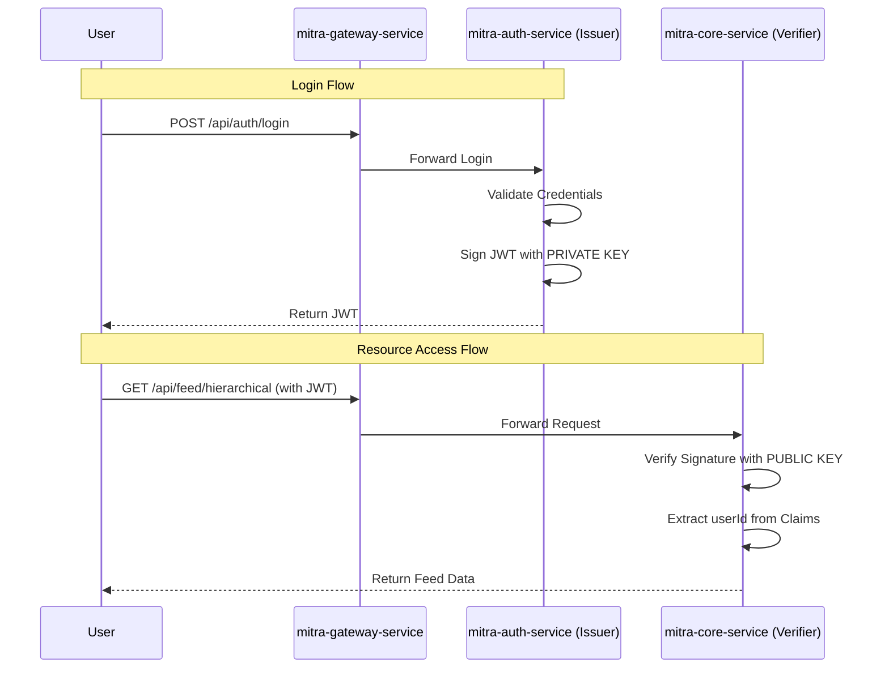

# JWT Authentication Flow: MitraAI Architecture

MitraAI uses **Stateless, Asymmetric JWT Authentication** based on the **RS256** algorithm. Only `mitra-auth-service` can issue tokens; all other services verify them locally using a Public Key — no network call to auth is needed during resource access.

---

## 1. Key Components

| Component | Responsibility | Security Asset |
| :--- | :--- | :--- |
| **mitra-auth-service** | **Issuer**: Authenticates users & issues tokens. | **Private Key** (`keystore.jks`) |
| **mitra-core-service** | **Verifier**: Validates tokens on every request. | **Public Key** (`public_key.pem`) |
| **mitra-gateway-service** | **Router**: Routes requests to the correct service. | Route & role configuration |

---

## 2. Authentication Process

### Phase A — Token Issuance (Login)
1. User sends `POST /api/auth/login` to the API Gateway.
2. Gateway forwards to `mitra-auth-service`.
3. Auth service verifies credentials against MySQL.
4. `JwtUtil` signs a JWT with `userId` + `username` using the **RS256 Private Key**.
5. Signed JWT returned to the user.

### Phase B — Token Validation (Resource Access)
1. User sends a request (e.g., `GET /api/feed/hierarchical`) with `Authorization: Bearer <token>`.
2. Gateway routes the request to `mitra-core-service`.
3. `JwtAuthenticationFilter` intercepts and extracts the JWT.
4. `JwtUtil` verifies the signature using the **Public Key** — **no auth service call**.
5. `userId` is placed in the `SecurityContextHolder`.
6. Controller processes the request using the authenticated `userId`.

---

## 3. Why RS256 (Asymmetric)?

| Algorithm | Risk |
| :--- | :--- |
| HS256 (shared secret) | Any compromised service can forge tokens |
| **RS256 (private/public pair)** | Only auth-service can sign; others can only verify |

---

## 4. Sequence Diagram

```mermaid
sequenceDiagram
    participant User
    participant Gateway as mitra-gateway-service
    participant Auth as mitra-auth-service (Issuer)
    participant Core as mitra-core-service (Verifier)

    Note over User,Auth: Login Flow
    User->>Gateway: POST /api/auth/login
    Gateway->>Auth: Forward Login
    Auth->>Auth: Validate Credentials
    Auth->>Auth: Sign JWT with PRIVATE KEY
    Auth-->>User: Return JWT

    Note over User,Core: Resource Access Flow
    User->>Gateway: GET /api/feed/hierarchical (with JWT)
    Gateway->>Core: Forward Request
    Core->>Core: Verify Signature with PUBLIC KEY
    Core->>Core: Extract userId from Claims
    Core-->>User: Return Feed Data
```

---

## 5. Security Summary

- **Stateless**: No server-side session storage.
- **Decoupled**: Services validate tokens independently.
- **Secure**: Private key never leaves `mitra-auth-service`.
