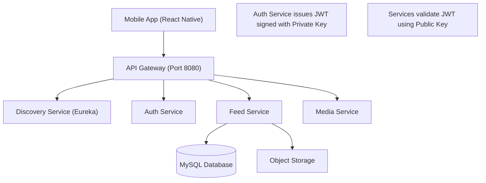

# Walkthrough: Request Flow Explanation

I have researched the architectural flow for `GET /api/feed/hierarchical` and updated the `implementation_plan.md` accordingly.

## 1. Updated Architecture Diagram
The diagram now explicitly shows the **API Gateway** and **Discovery Service (Eureka)**, as well as the interaction between services regarding JWT validation.

## 2. Request Flow Breakdown
For the request `GET http://localhost:8080/api/feed/hierarchical`:

1.  **API Gateway (`gateway-service`)**:
    *   Receives the request on port 8080.
    *   Finds the route `/api/feed/**` and queries **Discovery Service (Eureka)** to get the current location of `FEED-SERVICE`.
    *   Forwards the request (with original headers) to the `feed-service` instance.
2.  **Discovery Service (`discovery-service`)**:
    *   Provides the registry information so the Gateway can route requests dynamically without hardcoded IPs.
3.  **Feed Service (`feed-service`)**:
    *   **JwtAuthenticationFilter**: Intercepts the request and extracts the JWT.
    *   **JwtUtil**: Validates the token using a **Public Key** (no call to Auth Service needed). This ensures high performance and service independence.
    *   **Security Context**: Hydrates the `SecurityContextHolder` with `userId` from the token.
    *   **Controller**: `FeedController` executes the business logic.
4.  **Auth Service (`auth-service`)**:
    *   **Not involved** during this specific request. It only handles the initial login/signup to issue the token.

## 3. Changes Made
- Updated [implementation_plan.md](file:///d:/Vinayak/Personal_Project/Antigravity/implementation_plan.md) with the new diagram and flow sections.
- Re-organized the numbering in `implementation_plan.md` for better structure.

## 4. Debugging: 415 Unsupported Media Type
The `415` error occurred because the `POST /api/stories` endpoint was strictly expecting `multipart/form-data` (which includes both a JSON `story` part and an optional `file` part). Sending raw `application/json` caused the failure.

### Fixes Applied:
- **StoryController**: Added an overloaded `createStoryJson` method that consumes `application/json`. You can now post stories without files using a regular JSON body.
- **SecurityConfig**: Added `permitAll()` for the `/error` endpoint. This ensures that if a server-side error occurs, Spring can display the error details instead of being blocked by a secondary `403 Forbidden` error on the error page itself.
