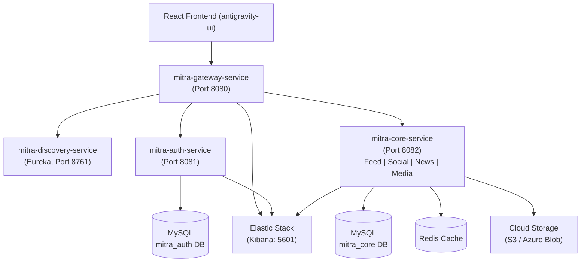

# MitraAI — Architecture Walkthrough

## 1. Macroservice Architecture

MitraAI consolidates four previously separate microservices into `mitra-core-service`, dramatically reducing operational overhead while retaining domain separation at the code level.


```mermaid
graph TD
    UI["React Frontend (antigravity-ui)"] --> Gateway["mitra-gateway-service\n(Port 8080)"]
    Gateway --> Discovery["mitra-discovery-service\n(Eureka, Port 8761)"]
    Gateway --> Auth["mitra-auth-service\n(Port 8081)"]
    Gateway --> Core["mitra-core-service\n(Port 8082)\nFeed | Social | News | Media"]

    Auth --> MySQL[(MySQL\nmitra_auth DB)]
    Core --> MySQL2[(MySQL\nmitra_core DB)]
    Core --> Redis[(Redis Cache)]
    Core --> Storage["Cloud Storage\n(S3 / Azure Blob)"]

    Gateway --> ELK["Elastic Stack\n(Kibana: 5601)"]
    Auth --> ELK
    Core --> ELK
```

---

## 2. Request Flow: `GET /api/feed/hierarchical`

1. **Gateway** receives the request on port 8080.
2. Route `/api/feed/**` matches → Gateway queries **Eureka** for `MITRA-CORE-SERVICE`.
3. Request is forwarded to `mitra-core-service` with original `Authorization` header.
4. **`JwtAuthenticationFilter`** in core service intercepts and extracts the JWT.
5. **`JwtUtil`** verifies the token using the **Public Key** — no call to auth service.
6. `userId` is placed in `SecurityContextHolder`.
7. `FeedController` → `FeedServiceImpl` → `StoryRepository` → MySQL query.
8. Response returned through Gateway to the client.

---

## 3. Internal Module Layout (`mitra-core-service`)

All domain code retains its sub-package structure within a single deployable JAR:

| Package | Domain |
| :--- | :--- |
| `com.mitraai.core.feed` | Stories, location-based feed |
| `com.mitraai.core.social` | Friends, groups |
| `com.mitraai.core.news` | News ingestion, localized feed |
| `com.mitraai.core.media` | File upload/download |
| `com.mitraai.core.security` | Shared JWT filter & config |
| `com.mitraai.core.config` | Redis, Feign, Jackson, Storage |
| `com.mitraai.core.client` | Feign clients (auth, social, media) |
| `com.mitraai.core.dto` | Shared DTOs |

---

## 4. Consolidated Security

A single `SecurityConfig` in `com.mitraai.core.security` covers all API paths:

```java
.requestMatchers(
    "/api/feed/**", "/api/news/**", "/api/social/**", "/api/media/**",
    "/v3/api-docs/**", "/swagger-ui/**", "/actuator/health", ...
).permitAll()
.anyRequest().authenticated()
```

---

## 5. Notable Fixes Applied During Consolidation

| Issue | Fix |
| :--- | :--- |
| 4 duplicate `@SpringBootApplication` classes | Replaced with single `CoreApplication.java` |
| 4 duplicate `SecurityConfig` / `JwtUtil` | Consolidated into `com.mitraai.core.security` |
| Duplicate `RedisConfig`, `FeignConfig`, `JacksonConfig` | Moved to `com.mitraai.core.config` |
| Duplicate `AuthServiceClient`, `UserLocationDTO` | Moved to shared `client`/`dto` packages |
| Missing `LocationData`, `LocalizedFeedResponse`, `NewsArticle` DTOs | Created in `com.mitraai.core.dto` |
| Missing `MediaServiceClient`, `SocialClient` Feign clients | Created in `com.mitraai.core.client` |
| `pubDate` type mismatch (LocalDateTime vs String) | Fixed in `NewsArticle` DTO |
