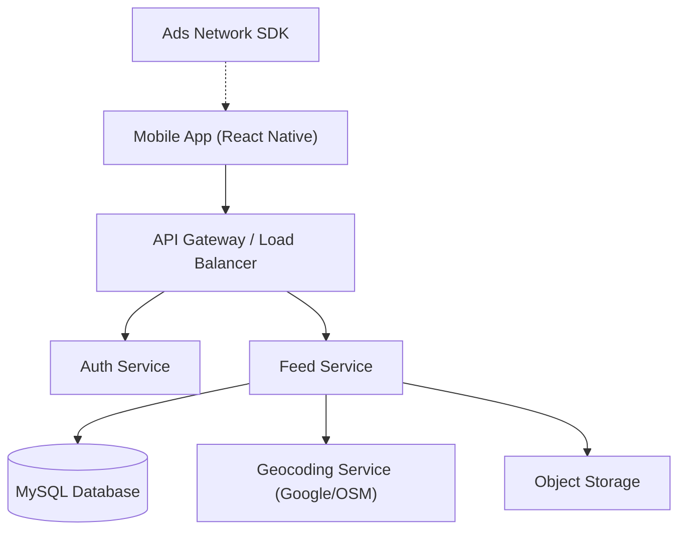

# Design Document: Location-Based Feed Application

## 1. System Overview
The application is a location-based social feed platform for Android and iOS. Users can share stories (Audio, Video, Text) and consume content relevant to their current location. It features a **Hierarchical Feed System**, prioritizing content from the user's immediate Village/Taluk up to District and State levels.

### High-Level Requirements
- **Platforms**: Android & iOS (React Native)
- **Backend**: Java Spring Boot
- **Database**: **MySQL 8.0+** (Selected for Spatial support + Relational stability)
- **Location Strategy**: Hybrid (Hierarchical Administrative Regions + Geospatial Proximity)
- **Storage**: AWS S3 / MinIO

## 2. Architecture Diagram

## 3. Backend Design (Spring Boot)
### 3.1 Technologies
- **Framework**: Spring Boot 3.x
- **Database**: MySQL 8.x
- **Maps/Geocoding**: Google Maps API or OpenStreetMap (Nominatim) for Reverse Geocoding.

### 3.2 Key Logic: Hierarchical Feed
The feed will fetch content in priority buckets:
1.  **Village/Town Level**: Exact match on `village_name`.
2.  **Taluk/Sub-District Level**: Match `taluk_name`, exclude already seen.
3.  **District Level**: Match `district_name`.
4.  **State/Country**: Trending items in the region.

### 3.3 Database Schema (MySQL)
**Users Table**
- `id`, `username`, `email`
- `home_location` (POINT) - Exact coordinate
- `village` (VARCHAR), `taluk` (VARCHAR), `district` (VARCHAR), `state` (VARCHAR) - *Auto-filled via Geocoding, editable by user.*

**Stories Table**
- `id`, `user_id`, `type`
- `location` (POINT)
- `village`, `taluk`, `district`, `state` - *Captured at time of upload.*

## 4. Frontend Design (React Native)
### 4.1 Signup Flow Changes
- **Location Permission Request**.
- **Auto-Detect**: Fetch Lat/Lng -> Call API to populate Village/Taluk/etc.
- **Manual Confirmation**: User confirms or edits their "Home Location" details.

## 5. API Endpoints (Refined)
### Stories
- `GET /api/feeds/hierarchical?userId=...`
    - Backend logic determines the mix of Village vs District content.

### Metadata / Utilities
- `GET /api/location/reverse-geocode?lat=...&lng=...`
    - Returns: `{ village: "...", taluk: "...", district: "..." }`

## User Review Required
> [!IMPORTANT]
> **Geocoding API Costs**: Reverse geocoding (converting Lat/Lng to Village Name) on every post/signup can incur costs (Google Maps) or rate limits (OpenStreetMap). We should implement **Caching** or use a self-hosted Geocoder if volume is high.
